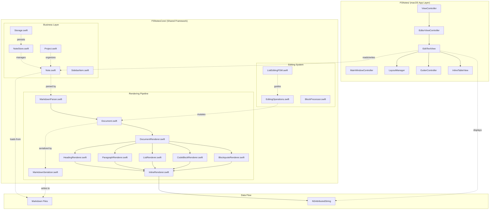
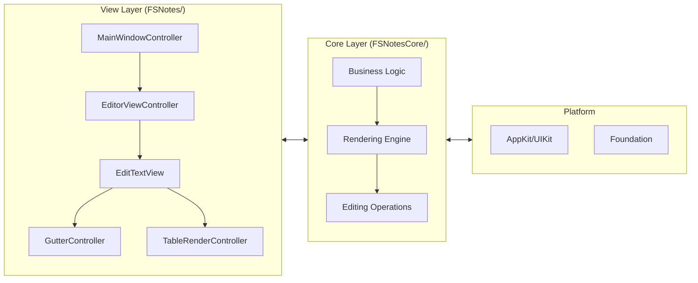
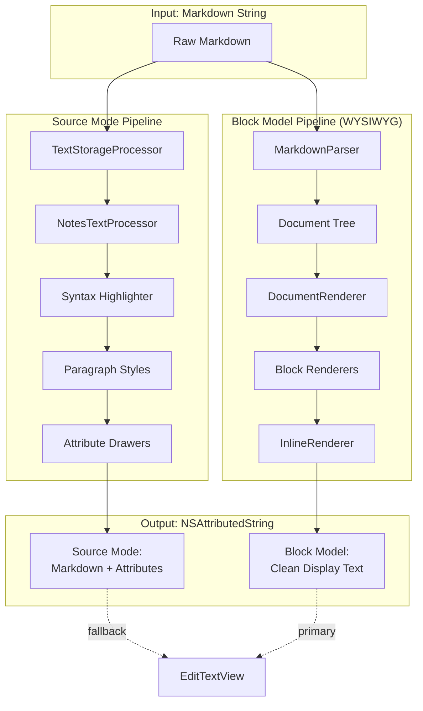

 # FSNotes++ Architecture

## Overview

FSNotes++ is a WYSIWYG markdown editor for macOS, forked from FSNotes. The app renders markdown in a single NSTextView — there is no separate HTML preview.

The codebase currently contains **two rendering architectures running side-by-side**:

1. **Source-mode pipeline** (source mode only): text storage = original markdown; rendering via attributes + clear-color/negative-kern hiding + custom LayoutManager drawing. Described in "Rendering Pipeline" below.
2. **Block-model pipeline** (active for WYSIWYG mode): markdown is parsed once into a `Document`; the renderer consumes that tree and emits an NSAttributedString whose `.string` contains ONLY displayed characters. Source markers (`#`, `**`, `-`, `>`, fences, etc.) never reach the rendered output. All 7 block types are supported. Editing operations route through `EditingOps` and structural operations (list indent/unindent/exit) use a finite state machine. Described in "Block-Model Rendering (Target Architecture)" and "Editing Finite State Machines" below.

The block model is the active rendering pipeline for WYSIWYG mode. The source-mode pipeline is preserved for source mode.

**Bundle ID**: `co.fluder.FSNotes` (shared with original FSNotes for same notes folder)
**Product Name**: `FSNotes++`
**Deploy Path**: `~/Applications/FSNotes++.app`
**Workspace**: `FSNotes.xcworkspace`
**Scheme**: `FSNotes`

## System Architecture Diagram



## Component Architecture



## Dual Rendering Pipeline



## Targets

| Target | Path | Purpose |
|--------|------|---------|
| FSNotes | `FSNotes/` | macOS app: views, LayoutManager, drawers, toolbar |
| FSNotesCore | `FSNotesCore/` | Framework: parsing, highlighting, formatting, serialization |
| FSNotesTests | `Tests/` | Unit tests, visual snapshots, A/B comparisons |

## Module Structure

### FSNotes/ (macOS Application)
```
FSNotes/
├── ViewControllers/
│   ├── ViewController.swift           # Main window controller
│   ├── EditorViewController.swift     # Editor coordination
│   ├── NoteViewController.swift       # Note-specific logic
│   ├── MainWindowController.swift     # Window management
│   └── PrefsViewController.swift      # Preferences
├── Views/
│   ├── EditTextView.swift             # Main text editor
│   ├── EditTextView+BlockModel.swift  # WYSIWYG integration
│   ├── EditTextView+Formatting.swift  # Toolbar actions
│   ├── EditTextView+NoteState.swift   # Save/load
│   ├── NotesTableView.swift           # Note list sidebar
│   └── SearchTextField.swift          # Search UI
├── Rendering/
│   ├── LayoutManager.swift            # Custom glyph drawing
│   ├── AttributeDrawer.swift          # Drawer protocol
│   ├── BulletDrawer.swift             # List bullets
│   ├── BlockquoteBorderDrawer.swift   # Quote borders
│   └── HorizontalRuleDrawer.swift     # HR lines
├── Helpers/
│   ├── InlineTableView.swift          # Table widget
│   ├── GutterController.swift         # Fold/icons gutter
│   └── TableRenderController.swift    # Table rendering
└── Extensions/                        # Platform extensions
```

### FSNotesCore/ (Shared Framework)
```
FSNotesCore/
├── Business/                          # Data models
│   ├── Note.swift                     # Note entity
│   ├── Project.swift                  # Project/folder
│   ├── Storage.swift                  # File system
│   ├── NoteStore.swift                # In-memory cache
│   └── SidebarItem.swift              # Sidebar model
├── Rendering/                         # Block model (NEW)
│   ├── Document.swift                 # AST definition
│   ├── MarkdownParser.swift           # Parse markdown → Document
│   ├── MarkdownSerializer.swift       # Serialize Document → markdown
│   ├── DocumentRenderer.swift         # Document → NSAttributedString
│   ├── DocumentProjection.swift       # View model
│   ├── EditingOperations.swift        # Edit transforms
│   ├── ListEditingFSM.swift           # List state machine
│   ├── HeadingRenderer.swift          # Heading blocks
│   ├── ParagraphRenderer.swift        # Paragraph blocks
│   ├── ListRenderer.swift             # List blocks
│   ├── CodeBlockRenderer.swift        # Code blocks
│   ├── BlockquoteRenderer.swift       # Blockquote blocks
│   ├── InlineRenderer.swift           # Inline formatting
│   └── NoteSerializer.swift           # Legacy save (source mode)
├── Git/                               # Version control
└── Extensions/                        # Core extensions
```

## Source-Mode Rendering Pipeline (source mode only)

When `blockModelActive == false` (source mode, non-markdown notes), every text change triggers `NSTextStorage.didProcessEditing` → `TextStorageProcessor.process()`. This pipeline is bypassed entirely in WYSIWYG mode — see "Block-Model Rendering" below. The source-mode pipeline runs in this order:

### Stage 1: Markdown Highlighting
**File**: `FSNotesCore/NotesTextProcessor.swift`
**Method**: `highlightMarkdown(attributedString:paragraphRange:codeBlockRanges:)`
**Owns**: `.font` (heading sizes, bold/italic traits), `.foregroundColor` (syntax color), `.link`, `.strikethroughStyle`, `.underlineStyle`

Applies heading fonts (excluding trailing `\n` — root cause fix for cursor height after Return). Detects bold, italic, strikethrough, links, inline HTML tags.

### Stage 2: Code Block Highlighting
**File**: `FSNotesCore/SwiftHighlighter/`
**Method**: `getHighlighter().highlight(in:fullRange:)`
Language-specific syntax coloring inside fenced code blocks.

### Stage 3: Phase 4 — Syntax Hiding (REMOVED)
**Status**: Deleted. The block-model `DocumentRenderer` now handles all syntax hiding by never placing markdown markers in `textStorage` in the first place. The functions `phase4_hideSyntax`, `hideSyntaxRange`, `alphaMarker`, `romanMarker`, `orderedMarkerText`, `BlockquoteProcessor`, and `HorizontalRuleProcessor` have been removed.

**Global flag**: `NotesTextProcessor.hideSyntax` still exists for source-mode inline highlighting via `hideSyntaxIfNecessary()`.

### Stage 4: Phase 5 — Paragraph Styles
**File**: `FSNotesCore/TextStorageProcessor.swift` → `phase5_paragraphStyles()`
**Owns**: `.paragraphStyle` (lineSpacing, headIndent, firstLineHeadIndent, paragraphSpacing, paragraphSpacingBefore)

Sets block-type-specific paragraph styles:
- **Headings**: Progressive spacing (H1: 0.67em, H2: 16px, etc.)
- **Lists (tabs-as-metadata model)**: `firstLineHeadIndent` = slotWidth (constant), `headIndent` = slotWidth + depth*listStep, per-depth `NSTextTab` stops at slotWidth + i*listStep. Leading tab chars advance the pen through the tab stops; wrapped lines align at `headIndent`. Marker glyph is drawn by LayoutManager into the slot to the left of the text, not rendered as text.
- **Todo items**: Same indent pattern as lists, measures checkbox attachment width
- **Empty blocks**: Explicit body paragraph style (prevents inheritance from headings/lists)
- **Paragraphs**: `paragraphSpacing` = 12

**Range expansion**: Phase5's range includes the previous AND next paragraph beyond the edit, so boundary transitions (heading→body, list exit) get correct styles.

### Stage 5: Drawing — AttributeDrawers
**File**: `FSNotes/LayoutManager.swift` → `drawBackground(forGlyphRange:at:)`
**Protocol**: `FSNotes/Rendering/AttributeDrawer.swift`

Custom visual elements drawn during layout, without modifying storage:
- `BulletDrawer` — draws `•` at `.bulletMarker` positions (uses `boundingRect` since `-` has preserved width)
- `HorizontalRuleDrawer` — draws 4px gray line for `.horizontalRule`
- `BlockquoteBorderDrawer` — draws left border for `.blockquote`
- `KbdBoxDrawer` — draws rounded box for `.kbdTag`

**Fold gate**: `unfoldedRanges(in:)` filters ALL rendering -- folded content never reaches any drawer.

## Block Model

**File**: `FSNotesCore/MarkdownBlockParser.swift`

### MarkdownBlock
```
type: MarkdownBlockType    — heading, paragraph, list, codeBlock, etc.
range: NSRange             — full range including syntax
contentRange: NSRange      — visible content only
syntaxRanges: [NSRange]    — characters to hide in WYSIWYG
collapsed: Bool            — fold state
renderMode: BlockRenderMode — .source or .rendered (mermaid/math)
```

### Block Types
`paragraph`, `heading(level: 1-6)`, `headingSetext(level: 1-2)`, `codeBlock(language:)`, `blockquote`, `unorderedList`, `orderedList`, `todoItem(checked:)`, `horizontalRule`, `table`, `yamlFrontmatter`, `empty`

### Parsing
- **Full parse**: `MarkdownBlockParser.parse(string:)` — on initial load or when blocks are empty
- **Incremental**: `adjustBlocks(forEditAt:delta:)` shifts ranges, marks dirty blocks; `reparseBlocks(dirtyIndices:string:)` re-parses only affected blocks
- **Boundary fix**: `adjustBlocks` uses `<` (not `<=`) so edits at the end of a block extend it rather than creating orphan characters
- Blocks stored in `TextStorageProcessor.blocks: [MarkdownBlock]`

## Return Key State Machine

**File**: `FSNotesCore/TextFormatter.swift`

### NewLineTransition Enum
| Transition | When | What happens |
|-----------|------|-------------|
| `.bodyText` | After heading, default | Insert `\n`, reset typing attrs to body font/paragraph style |
| `.continueUnorderedList(prefix)` | After bullet with content | Insert `\n` + prefix (e.g., `"- "`) |
| `.continueNumberedList(next)` | After numbered item | Insert `\n` + incremented prefix (e.g., `"2. "`) |
| `.continueCheckbox(prefix, todoLocation)` | After checkbox with content | Insert `\n` + prefix + unchecked checkbox |
| `.continueIndent(prefix)` | After indented line | Insert `\n` + tabs/spaces |
| `.exitList(paragraphRange)` | Empty bullet line | Delete line, insert `\n` |
| `.exitTodo(paragraphRange)` | Empty checkbox line | Delete line, insert `\n` |

### Flow
1. `newLine()` gets current paragraph, calls `newLineTransition()` (pure function)
2. `applyTransition()` executes the transition (text insertion)
3. Post-transition: sets typing attributes based on target state:
   - Exit transitions → body paragraph style
   - Continue transitions → copy paragraph style from previous line

### Key Principle
Typing attributes are set AFTER `insertText` (not before), because `didProcessEditing` runs synchronously during insertion and overwrites pre-set attributes. The post-transition block in `newLine()` handles ALL transitions in one place.

## Formatting Toggle System

### Block-Model Path (WYSIWYG mode)

**Files**: `FSNotesCore/Rendering/EditingOperations.swift`, `FSNotes/View/EditTextView+BlockModel.swift`

Toolbar actions route through block-model operations when `documentProjection` is active:

**Inline trait toggle** (`EditingOps.toggleInlineTrait`):
- Bold, italic, strikethrough, code — wraps/unwraps selection in the inline tree
- Works on paragraphs, headings, list items, blockquotes
- Pure function: (projection, selection range, trait) → (new projection, splice)

**Block-level conversions**:
- `EditingOps.changeHeadingLevel(level, at:, in:)` — paragraph ↔ heading, level change, toggle off
- `EditingOps.toggleList(marker:, at:, in:)` — paragraph ↔ list
- `EditingOps.toggleBlockquote(at:, in:)` — paragraph ↔ blockquote
- `EditingOps.insertHorizontalRule(at:, in:)` — inserts HR after current block

**Wiring**: `EditTextView+Formatting.swift` tries block-model path first via `toggle*ViaBlockModel()` methods. Falls back to source-mode TextFormatter if projection is nil or operation throws.

### Source-Mode Path (source mode fallback)

**File**: `FSNotesCore/TextFormatter.swift` → `toggleMarkers(open:close:)`

Single generic method for all marker-based formatting:
- `bold()` → `toggleMarkers(open: "**", close: "**")`
- `italic()` → `toggleMarkers(open: "*", close: "*")`
- `underline()` → `toggleMarkers(open: "<u>", close: "</u>")`
- `strike()` → `toggleMarkers(open: "~~", close: "~~")`
- `highlight()` → `toggleMarkers(open: "<mark>", close: "</mark>")`

**Detection**: Checks characters immediately before/after selection, then searches backward/forward for markers. If found → remove. If not → wrap.

**Toolbar state**: `FormattingToolbar.updateButtonStates(for:)` reads `typingAttributes` (when cursor is a point) or storage attributes (when selection exists). Called from `textViewDidChangeSelection`.

## Save Pipeline

### Block-Model Path (WYSIWYG mode)

**File**: `FSNotes/View/EditTextView+NoteState.swift` → `save()`

When `documentProjection` is active, save serializes the Document back to markdown via `MarkdownSerializer.serialize()` → `Note.save(markdown:)`. This bypasses `NoteSerializer.prepareForSave()` entirely — no attribute stripping needed because the Document IS the source of truth. The serialized markdown is written directly to disk.

All save call sites route through `EditorDelegate.save()` (protocol method on EditTextView), including TextFormatter's `deinit`.

### Source-Mode Path (source mode)

**File**: `FSNotesCore/Rendering/NoteSerializer.swift` → `prepareForSave()`

```
1. restoreRenderedBlocks() — mermaid/math images → original markdown
2. unloadImagesAndFiles()  — image attachments → 
```

**Safety**: `getFileWrapper()` throws on error (never returns empty FileWrapper). `save(content:)` and `save(markdown:)` both block writes for empty content.

## Gutter Icons

**File**: `FSNotes/GutterController.swift`

The 32pt-wide gutter on the left of the editor hosts: fold carets (▶/▼), H-level badges, code-block copy icons, and table copy icons. All icons render at 26pt, `calibratedWhite: 0.55` gray, same font family — only the glyph changes on state (⎘ → ✓ after copy, 1.5s feedback).

**Code block copy**: Iterates `processor.blocks`, finds `.codeBlock` in source mode, draws ⎘ at the fence line. Click copies `contentRange` (between fences) as plain text.

**Table copy**: Enumerates `.renderedBlockType == "table"` attributes in the visible range (tables are always single-char rendered attachments). Click parses `.renderedBlockOriginalMarkdown` via `TableUtility.parse()` and writes TSV + HTML + plain-string to the pasteboard. HTML output lets Excel/Numbers/Word/Google Docs receive a proper table.

## Search ↔ Selection FSM

**Files**: `FSNotes/ViewController.swift` (state fields), `FSNotes/View/SearchTextField.swift` (search trigger), `FSNotes/View/NotesTableView.swift` (selection change)

State fields on ViewController:
- `preSearchNote: Note?` — snapshot of active note when search begins
- `searchWasActive: Bool` — tracks search field transitions
- `isProgrammaticSearchSelection: Bool` — distinguishes FSM-driven selection from user clicks

Transitions:
1. **Search on** (empty → non-empty): snapshot `preSearchNote = editor.note`, auto-select top filtered result (flag as programmatic).
2. **User clicks a different note during active search**: `tableViewSelectionDidChange` clears `preSearchNote` (deliberate choice takes priority).
3. **Search off** (non-empty → empty): if `preSearchNote` is still set, restore it.

## Pin Persistence

**File**: `FSNotesCore/Extensions/Storage+Persistence.swift` → `CloudPinStore`

Pins persist to `UserDefaults.standard` synchronously on every toggle (with `synchronize()`). Pre-fork code gated this behind `#if CLOUD_RELATED_BLOCK` making `save()` a no-op in non-cloud builds; pins only lived in the periodic project cache and were lost on crash. iCloud `NSUbiquitousKeyValueStore` is still used as an additional layer when the flag is active.

## Fold System

**File**: `FSNotesCore/TextStorageProcessor.swift` → `toggleFold(headerBlockIndex:textStorage:)`

- Fold range: from after heading's `\n` to next heading of same or higher level
- `.foldedContent` attribute gates ALL rendering in LayoutManager
- InlineTableView subviews hidden directly during fold
- Gutter shows `▶`/`▼` carets, H-level badges, `⋯` ellipsis for collapsed headers

**Block-model bridge**: When `blockModelActive == true`, the source-mode `blocks` array is populated via `syncBlocksFromProjection()` — maps Document heading blocks to MarkdownBlock entries with rendered blockSpan ranges. This lets the existing fold code work without rewriting it. Unfold restores attributes from the projection's rendered output instead of calling `highlightMarkdown()`.

## Table Widget

**File**: `FSNotes/Helpers/InlineTableView.swift`

Three focus states: `.unfocused`, `.hovered`, `.editing`. Rendered as NSTextAttachment inside the editor. `TableRenderController` manages creation from markdown table blocks. Grid drawn by `GridDocumentView`. Column/row handles are `GlassHandleView` (frosted glass effect with `⋮⋮` grip icons, cornerRadius=8).

**Grid drawing order** (in `drawGridLines`): header fill → alternating row fills → stroke. Backgrounds are painted first so grid lines stay full-strength (translucent fills on top dilute the stroke color). Boundary horizontal/vertical lines are inset by `gridLineWidth/2` so strokes aren't clipped by the parent bounds. Grid lines: solid `calibratedWhite: 0.4`. Header fill: solid `calibratedWhite: 0.85`. Alt-row fill (starting at row 0): solid `calibratedWhite: 0.95`. Top margin is always reserved to prevent layout jump on hover.

**Copy button**: drawn in the gutter next to the table attachment (not on the table itself). See Gutter Icons below.

## Custom Attribute Keys

**File**: `FSNotesCore/Extensions/NSAttributedStringKey+.swift`

| Key | Type | Set by | Used by | Status |
|-----|------|--------|---------|--------|
| `.bulletMarker` | Bool | (source-mode only) | BulletDrawer | Orphaned in block-model mode |
| `.checkboxMarker` | Bool | (source-mode only) | CheckboxDrawer | Orphaned in block-model mode |
| `.orderedMarker` | String | (source-mode only) | OrderedMarkerDrawer | Orphaned in block-model mode |
| `.listDepth` | Int | (source-mode only) | LayoutManager | Orphaned in block-model mode |
| `.horizontalRule` | Bool | (source-mode only) | HorizontalRuleDrawer | Orphaned in block-model mode |
| `.blockquote` | Int (depth) | (source-mode only) | BlockquoteBorderDrawer | Orphaned in block-model mode |
| `.kbdTag` | Bool | InlineTagRegistry | KbdBoxDrawer | Active |
| `.todo` | Int (0/1) | (source-mode only) | Checkbox click handling | Source-mode only |
| `.foldedContent` | Bool | toggleFold | LayoutManager gate | Active (bridged) |
| `.renderedBlockOriginalMarkdown` | String | Mermaid/math/table renderer | Save pipeline, table copy | Source-mode only |
| `.renderedBlockType` | String | Mermaid/math/table renderer | Table click/copy routing | Source-mode only |

**Note**: The block-model pipeline renders bullets, checkboxes, ordered markers, HR, and blockquotes as text characters or paragraph styles directly in the rendered `NSAttributedString` — no custom attributes needed. The source-mode LayoutManager drawing for these attributes is skipped when `blockModelActive == true`.

## Paste Handling

**File**: `FSNotes/View/EditTextView+Clipboard.swift` → `paste(_:)`

Paste priority order (first match wins):
1. RTFD attributed string
2. File URL (save into note)
3. **TSV** (`public.utf8-tab-separated-values-text`) → markdown table via `tsvToMarkdownTable()`, then `renderTables()`
4. **HTML with `<table>`** → markdown table via `htmlTableToMarkdown()`, then `renderTables()`
5. PDF (save with thumbnail attachment)
6. PNG/TIFF (insert as image)
7. Plain string

TSV/HTML table checks run **before** PDF/image because Excel/Numbers/web pages put all types on the clipboard simultaneously. Preferring tabular data means table cells round-trip as markdown tables instead of PDF thumbnails.

## Menu Action Routing

Storyboard menu items point their action target at the `ViewController` customObject `L4m-js-agn`, which is a **placeholder instance** with only `showInSidebar` and `sortByOutlet` outlets connected. Actions that need outlets wired to the real main-window VC (e.g. `editor`) must route through `ViewController.shared()` (which returns `AppDelegate.mainWindowController?.window?.contentViewController as? ViewController`), otherwise force-unwrapping an IBOutlet on the placeholder crashes with `_assertionFailure`.

Also avoid selector names that collide with AppKit (`fold:`, `unfold:` conflict with NSTextView). Renamed to `foldCurrentHeader:` / `unfoldCurrentHeader:` (⌥⌘← / ⌥⌘→).

## Test Infrastructure

### Running Tests
```bash
xcodebuild test -workspace FSNotes.xcworkspace -scheme FSNotes \
  -destination 'platform=macOS' -only-testing:FSNotesTests
```

### Test Output
Test host is sandboxed. Write output to container:
```swift
let outputDir = NSHomeDirectory() + "/unit-tests"
// Resolves to ~/Library/Containers/co.fluder.FSNotes/Data/unit-tests/
```

### Key Test Patterns

**HTML Parity** (general-purpose WYSIWYG regression harness — `EditorHTMLParityTests.swift`):
The editor's `documentProjection.document` is the same block-model `Document` that `CommonMarkHTMLRenderer` (from the CommonMark spec suite) already knows how to render to HTML. That gives a canonical normalized form for comparing editor state against expected markdown, ignoring fonts / paragraph styles / attachment bounds / typing attributes while preserving block structure, heading levels, list nesting, inline tree, and text content.

```
markdown ──parse──▶ Document ──HTMLRenderer──▶ HTML_ref
                                                     │
  editor ──▶ handleEditViaBlockModel / toolbar        │
     │                                                │
     ▼                                                │
  documentProjection.document ──HTMLRenderer──▶ HTML_live
                                                     │
                         assertEqual(HTML_ref, HTML_live)
```

Two test families live in `EditorHTMLParityTests.swift`:

- **Family A — fill parity**: `fill(editor, markdown)` then assert HTML matches a fresh parse of the same markdown. Pins the invariant that fill doesn't corrupt the parse. One test per block type + a mixed-document smoke test.
- **Family B — edit-script scenarios**: declarative `EditStep` DSL (`.type`, `.pressReturn`, `.backspace`, `.select`, `.toggleBold`, `.setHeading(level:)`, `.toggleList`, `.toggleQuote`, `.insertHR`, `.toggleTodo`) runs sequences of real editor mutations through the same entry points the NSTextView delegate and toolbar use (`handleEditViaBlockModel`, `*ViaBlockModel`), then asserts HTML parity. Each scenario is a one-liner per transition; add new ones freely as bugs are reported.

Every assertion also verifies `HTML(document) == HTML(parse(serialize(document)))` — the live Document must agree with its own round-trip, catching splice paths that produce state that wouldn't survive save/reload.

HTML comparison doesn't see attribute-level bugs (typing attributes, attachment geometry, LayoutManager-drawn bullets/HR/quote gutters). Those need targeted tests; see Visual Snapshot and A/B patterns below.

**Visual Snapshot** (verify rendered output):
1. Create `EditTextView` with `initTextStorage()` (full pipeline)
2. Set content via `textStorage?.setAttributedString()`
3. Call `runFullPipeline()` — sets note.content, triggers didProcessEditing, pumps RunLoop for async ops
4. `cacheDisplay(in:to:)` captures bitmap (NOTE: does NOT capture LayoutManager.drawBackground)
5. Check pixel values or save PNG for inspection

**A/B Comparison** (loaded vs typed):
1. Editor A: load content via `setAttributedString` + `runFullPipeline`
2. Editor B: load same content, then simulate user action (newLine(), insertText, etc.)
3. Compare line fragment positions, paragraph styles, attribute values
4. Assert gap/height/indent match between A and B

**Important**: `cacheDisplay` does NOT trigger LayoutManager's `drawBackground`. AttributeDrawer rendering (bullets, blockquote borders, etc.) won't appear in test snapshots. Test these by checking attributes exist, not by pixel verification.

### Test Files
| File | Tests | What it verifies |
|------|-------|-----------------|
| `ArchitectureEnforcementTests.swift` | 24 | No-kern, no-clear-color, no-markers-in-storage, idempotence |
| `ListFSMTests.swift` | 30 | List editing FSM transitions (indent, unindent, exit, newItem) |
| `BlockModelFormattingTests.swift` | 51 | Inline traits, heading/list/blockquote toggle, HR, todo, fold sync |
| `BlockParserTests.swift` | 35 | Block type detection, ranges, edge cases |
| `NewLineTransitionTests.swift` | 26+ | Return key transitions, A/B visual comparisons |
| `TableLayoutTests.swift` | 15 | Table geometry, padding, sizing, visual snapshots |
| `RoundTripTests.swift` | 169 | Parse → serialize byte-equal for all block types |
| `ListMarkerTests.swift` | 10 | Depth counting, visual bullet glyphs |
| `NoteSerializerTests.swift` | 9 | Save pipeline round-trip |
| `RendererComparisonTests.swift` | 2 | NSTextView rendering |
| `RenderingCorrectnessTests.swift` | 12 | Projection consistency, splice validity, block span bounds |
| `EditorHTMLParityTests.swift` | 14 | Fill parity + edit-script HTML parity via `CommonMarkHTMLRenderer` |
| `CommonMarkSpecTests.swift` | 27 | CommonMark v0.31.2 compliance (652 spec examples, ~80% passing) |

## Build & Deploy

Use the `xcode-build-deploy` skill. Key steps:
1. Quit app: `osascript -e 'tell application "FSNotes++" to quit'`
2. Delete DerivedData: `rm -rf ~/Library/Developer/Xcode/DerivedData/FSNotes-*`
3. Build: `xcodebuild build -workspace FSNotes.xcworkspace -scheme FSNotes -configuration Debug -destination 'platform=macOS'`
4. Deploy: `rm -rf ~/Applications/"FSNotes++.app" && cp -R .../FSNotes++.app ~/Applications/`
5. Sign: `codesign --force --deep --sign - ~/Applications/"FSNotes++.app"`
6. Launch: `open ~/Applications/"FSNotes++.app"`

**Critical**: Debug builds put code in `.debug.dylib`, not main executable. Always `rm -rf` before `cp -R` (POSIX nests instead of replacing).

## Architecture Principles

1. **Storage is rendered output** (WYSIWYG mode): `textStorage.string` contains only displayed characters — no markdown markers. Markdown lives on disk and in the Document model. The source-mode principle "storage is markdown" applies only to source mode.
2. **Each pipeline stage owns specific attributes**: Don't set `.paragraphStyle` outside DocumentRenderer. Don't set `.font` outside the renderer. The block model renders without `.kern` or clear-color hiding.
3. **Fix at the source stage**: When an attribute is wrong, find which stage sets it and fix there. Never patch downstream.
4. **One general solution**: When a pattern recurs (e.g., typing attributes after Return), solve it once for all cases, not per-case.
5. **Verify with rendered output**: Unit tests must check actual rendered output (pixels, attribute values), not just data model state.
6. **Editing mutates the Document**: User edits flow through `EditingOps` which mutates the block model. `textStorage` is re-rendered from the updated Document via splice operations.

## Block-Model Rendering (Target Architecture)

**Location**: `FSNotesCore/Rendering/` (new files) + `Tests/*RoundTripTests.swift` + `Tests/ArchitectureEnforcementTests.swift`

The block model eliminates WYSIWYG marker-hiding entirely. Instead of stuffing markers into storage and hiding them with clear color + negative kern, the parser consumes markers into a typed block tree, and the renderer emits a clean NSAttributedString.

### The Pipeline

```
raw markdown ──► MarkdownParser.parse ──► Document (Block tree)
                                              │
                                              ▼
                                    ┌──── Renderers ────┐
                                    │  CodeBlockRenderer │
                                    │  HeadingRenderer   │
                                    │  ParagraphRenderer │
                                    │  ListRenderer      │
                                    │  BlockquoteRenderer│
                                    │  HorizontalRuleRenderer
                                    │  InlineRenderer    │
                                    └────────┬──────────┘
                                             ▼
                                    NSAttributedString
                                    (no source markers)

raw markdown ◄── MarkdownSerializer.serialize ◄── Document
```

The `Document` is the single source of truth for rendering. Raw markdown exists only on disk and inside parse/serialize.

### The Block Model

**File**: `FSNotesCore/Rendering/Document.swift`

```swift
struct Document {
    var blocks: [Block]
    var trailingNewline: Bool       // preserved for byte-equal round-trip
}

enum Block {
    case codeBlock(language: String?, content: String, fence: FenceStyle)
    case heading(level: Int, suffix: String)
    case paragraph(inline: [Inline])
    case list(items: [ListItem])
    case blockquote(lines: [BlockquoteLine])
    case horizontalRule(character: Character, length: Int)
    case blankLine
}

indirect enum Inline {
    case text(String)
    case bold([Inline])          // **…**
    case italic([Inline])        // *…*
    case strikethrough([Inline]) // ~~…~~
    case code(String)            // `…`
}
```

`ListItem` carries `indent` / `marker` / `afterMarker` / `checkbox: Checkbox?` / `inline` / `children` (recursive nesting). `Checkbox` has `text` (`"[ ]"`, `"[x]"`, `"[X]"`) and `afterText` (whitespace) — nil for regular items, non-nil for todo items. `BlockquoteLine` carries `prefix` verbatim (e.g. `"> "`, `">> "`, `"> > "`) + parsed inlines. `FenceStyle` records fence char/length/infoRaw. These "source fingerprints" are preserved for byte-equal round-trip; the renderers never read them.

### The Four Architectural Invariants

All renderers MUST uphold these. Violations fail the build via `ArchitectureEnforcementTests`.

1. **No `.kern`-based width collapse** — rendered output MUST NOT contain any negative `.kern` attribute. If a character should not appear, do not put it in the rendered string.
2. **No clear-color hiding** — rendered output MUST NOT contain any character with `.foregroundColor` alpha == 0.
3. **No source markers in storage** — parser-consumed markers (fences, `#`, `-`/`*`/`+`/`N.`/`N)`, `**`/`*`, `` ` ``, `>`, HR runs) MUST NOT appear in the rendered string.
4. **Pure idempotent rendering** — `render(x) == render(x)` byte-equal. Renderers are pure functions of their inputs.

Plus the **round-trip invariant**: `serialize(parse(x)) == x`, byte-equal, for every valid markdown input.

### Block-Model Test Coverage

| Block type            | Round-trip | Architecture | Editing | Files |
|-----------------------|------------|--------------|---------|-------|
| Code block (fenced)   | 22         | 5            | insert/delete/split | `CodeBlockRenderer.swift` |
| Heading (ATX 1-6)     | 22         | 4            | level change, toggle | `HeadingRenderer.swift` |
| Paragraph + inlines   | 19         | 5            | bold/italic/code/strike | `ParagraphRenderer.swift`, `InlineRenderer.swift` |
| Code spans            | 17         | (in paragraph)| toggle | (in InlineRenderer) |
| List (nested, mixed)  | 26         | 6            | 30 FSM + indent/exit | `ListRenderer.swift`, `ListEditingFSM.swift` |
| Todo list (checkbox)  | 7+18       | (in list)    | toggle, convert | `ListRenderer.swift` |
| Horizontal rule       | 15         | 4            | insert | `HorizontalRuleRenderer.swift` |
| Blockquote (nested)   | 18         | 4            | toggle | `BlockquoteRenderer.swift` |

### Renderer Contract

Every renderer follows the same shape:

```swift
enum <Name>Renderer {
    static func render(<typed inputs>, bodyFont: PlatformFont) -> NSAttributedString
}
```

Inputs are strictly typed from the block model — never raw markdown. Output is an `NSAttributedString` whose `.string` is the DISPLAYED text only. No parsing or re-scanning happens in the renderer.

Visual indent normalization: `ListRenderer` and `BlockquoteRenderer` emit 2 spaces per nesting depth REGARDLESS of source indent. The original indent is preserved in the block model for serialization, but the renderer normalizes for display consistency.

### Architecture-Enforcement Tests (Tripwires)

**File**: `Tests/ArchitectureEnforcementTests.swift`

Every new renderer MUST append fixtures + checks here. The enforcement matrix runs on every PR:

- `test_<block>Renderer_noNegativeKern` — invariant 1
- `test_<block>Renderer_noClearForeground` — invariant 2
- `test_<block>Renderer_containsNo<Source>Markers` — invariant 3
- `test_<block>Renderer_isIdempotent` — invariant 4
- Semantic checks: bold runs carry bold-trait font, code spans carry monospace-trait font, etc.

These are permanent CI tripwires. Failing any of them is an architectural regression, not a cosmetic bug.

### Adding New Block Types

To add a new block type (e.g. tables, YAML frontmatter):

1. Extend `Document.swift` with the new block case + carrier struct (preserve source fingerprints for round-trip).
2. Extend `MarkdownParser.swift` with a detector; consume the line(s) in the main parse loop.
3. Extend `MarkdownSerializer.swift` with the matching serializer branch.
4. Write a new `<Block>Renderer.swift` following the renderer contract.
5. Add editing ops in `EditingOperations.swift` if the block is editable.
6. Add round-trip + architecture enforcement tests.
7. Add the new files to `FSNotes.xcodeproj/project.pbxproj`.

## In-Progress Work

### Block-Model Pipeline (Phase 7 — documentation and QA)
All 7 block types supported (paragraph, heading, codeBlock, blankLine, list, blockquote, horizontalRule). The block-model pipeline is active for all WYSIWYG rendering. All coupling sites have been migrated: fold/unfold bridged via `syncBlocksFromProjection()`, all `highlight()` calls guarded, LayoutManager source-mode drawing skipped when block model active. Save path optimized with `Note.save(markdown:)` bypassing `NoteSerializer`. Document caching on Note for performance.

## Editing Finite State Machines

The block-model pipeline uses finite state machines (FSMs) to define editing behavior for structural elements. Each FSM is a pure function: `(State, Action) -> Transition`. The caller applies the transition to the Document.

### List Editing FSM

Defined in `FSNotesCore/Rendering/ListEditingFSM.swift`. Controls indentation, list exit, and item creation.

**States:** `bodyText` (not in list), `listItem(depth=0)` (top-level), `listItem(depth>0)` (nested)

| State | Action | Transition |
|-------|--------|------------|
| bodyText | any key | noOp (stays in bodyText) |
| depth=0 | Tab (has prev sibling) | indent → depth>0 |
| depth=0 | Tab (no prev sibling) | noOp |
| depth=0 | Shift-Tab / Delete-at-home / Return-on-empty | exitToBody → bodyText |
| depth=0 | Return (non-empty) | newItem → depth=0 |
| depth>0 | Tab (has prev sibling) | indent (deeper) |
| depth>0 | Shift-Tab / Delete-at-home / Return-on-empty (depth>1) | unindent (shallower, stays depth>0) |
| depth>0 | Shift-Tab / Delete-at-home / Return-on-empty (depth=1) | unindent → depth=0 |
| depth>0 | Return (non-empty) | newItem (same depth) |

**Key behaviors:**
- **Tab** = indent item (becomes child of previous sibling). Only works if a previous sibling exists.
- **Shift-Tab** = unindent (depth > 0) or exit list (depth 0).
- **Delete at home** = same as Shift-Tab (unindent or exit).
- **Return on empty item** = same as Shift-Tab (unindent or exit).
- **Return on non-empty item** = insert new item after current.
- Exiting a list item converts it to a body paragraph.
- Bullet glyphs cycle by depth: `depth % 4` maps to `[bullet, white bullet, black small square, white small square]`.

### Return Key FSM (Source-Mode Pipeline)

Defined in `FSNotesCore/TextFormatter.swift` via `newLineTransition()` + `applyTransition()`. Still active for source mode. The block-model pipeline handles Return via `splitListOnNewline` / `splitParagraphOnNewline` / `returnOnEmptyListItem` in `EditingOperations.swift`.

| Context | Transition |
|---------|------------|
| Checkbox, empty content | exitTodo |
| Checkbox, has content | continueCheckbox |
| Unordered marker, empty content | exitList |
| Unordered marker, has content | continueUnorderedList |
| Numbered marker, empty content | exitList |
| Numbered marker, has content | continueNumberedList |
| Heading (#) | bodyText |
| Leading whitespace | continueIndent |
| Default | bodyText |

### Block Merge Operations (Delete at Block Boundary)

When the user presses Delete/Backspace at a block boundary, `EditingOps.delete()` calls `mergeAdjacentBlocks()` to combine two adjacent blocks. The merge rules are:

| Block A (first/upper) | Block B (second/lower) | Result |
|------------------------|------------------------|--------|
| paragraph | paragraph | paragraph (inlines concatenated) |
| paragraph | blankLine | paragraph (blank removed) |
| blankLine | paragraph | paragraph (blank removed) |
| blankLine | blankLine | blankLine |
| paragraph | heading | paragraph (heading demoted, text appended) |
| heading | paragraph | paragraph (heading demoted, text concatenated) |
| heading | heading | paragraph (both demoted, text concatenated) |
| blankLine | heading | heading (blank removed, heading preserved) |
| any | codeBlock | paragraph (code flattened to text) |
| any | list | paragraph (list text flattened) |
| any | blockquote | paragraph (blockquote text flattened) |

**Key principle:** Cross-block merges always produce a **paragraph**, with two exceptions:
1. When the first block is empty (blankLine/HR) and the second is a heading, the heading is preserved.
2. When both blocks have no content, the result is a blankLine.

The merge extracts inline content from both blocks via `remainingInlineSuffix` / `remainingInlinePrefix`, which handle all block types.

### Code Block FSM (Analysis)

Code blocks in the block-model pipeline do NOT need a separate FSM. Their editing model is simpler:

- All content inside a code block is literal text (no formatting, no markers).
- Tab inserts spaces/tabs (handled by existing `insertIntoBlock` for `.codeBlock`).
- Return inserts a newline (handled by the code block branch in `insert()` — code blocks accept `\n` as raw content).
- There is no indentation/unindentation concept for code blocks.
- Exiting a code block is done by clicking outside it (cursor moves to a different block).
- Converting a paragraph to a code block (typing ` ``` `) is a future feature not yet implemented.

No FSM is needed because code blocks have no state transitions — all input is treated uniformly as raw text insertion.

### Known Issues
- `cacheDisplay` doesn't capture LayoutManager.drawBackground — test snapshots miss AttributeDrawer output
- One pre-existing test failure: TableLayoutTests.test_copyButton_existsOnHover (UI test)