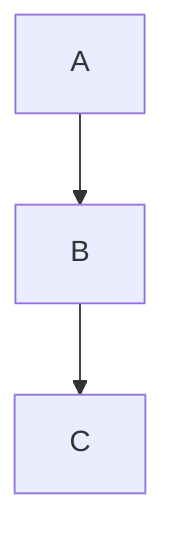

A short introduction paragraph before the diagram.

Inline math appears like $E = mc^2$ inside a sentence.

Display math stands on its own line below.

$$\int_0^1 x\,dx$$

A closing paragraph wraps up the file.
