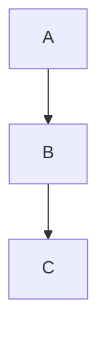

## Section 1: Lorem ipsum dolor sit amet

Lorem ipsum dolor sit amet, consectetur adipiscing elit, sed do eiusmod tempor incididunt ut labore et dolore magna aliqua. This paragraph **emphasizes** a key phrase and cites `someCode` inline.

Ut enim ad minim veniam, quis nostrud exercitation ullamco laboris nisi ut aliquip ex ea commodo consequat. Here we see *italic* prose and a [reference link](https://example.com/1).

## Section 2: Ut enim ad minim veniam

Duis aute irure dolor in reprehenderit in voluptate velit esse cillum dolore eu fugiat nulla pariatur. An escaped asterisk \* survives, alongside **bold with *nested italic* inside**.

Excepteur sint occaecat cupidatat non proident, sunt in culpa qui officia deserunt mollit anim id est laborum. Combining ~~strikethrough~~ with **bold** produces a layered effect.

## Section 3: Duis aute irure dolor in reprehenderit in voluptate velit esse cillum dolore eu fugiat nulla pariatur.

Sed ut perspiciatis unde omnis iste natus error sit voluptatem accusantium doloremque laudantium. We mention [[page-4]] wikilinks and tags like #topic-4 mid-sentence.

Totam rem aperiam, eaque ipsa quae ab illo inventore veritatis et quasi architecto beatae vitae dicta sunt. This paragraph **emphasizes** a key phrase and cites `someCode` inline.

## Section 4: Excepteur sint occaecat cupidatat non proident

Nemo enim ipsam voluptatem quia voluptas sit aspernatur aut odit aut fugit, sed quia consequuntur magni dolores. Here we see *italic* prose and a [reference link](https://example.com/6).

Neque porro quisquam est, qui dolorem ipsum quia dolor sit amet, consectetur, adipisci velit. An escaped asterisk \* survives, alongside **bold with *nested italic* inside**.

## Section 5: Sed ut perspiciatis unde omnis iste natus error sit voluptatem accusantium doloremque laudantium.

At vero eos et accusamus et iusto odio dignissimos ducimus qui blanditiis praesentium voluptatum deleniti atque corrupti. Combining ~~strikethrough~~ with **bold** produces a layered effect.

Et harum quidem rerum facilis est et expedita distinctio, nam libero tempore cum soluta nobis est eligendi optio. We mention [[page-9]] wikilinks and tags like #topic-9 mid-sentence.

### First List

- Alpha item with **bold** text
- Beta item with *italic* text
- Gamma item with `code` inline
- Delta item closes this list

### Second List (nested)

- Outer one
  - Inner alpha
  - Inner beta
- Outer two
- Outer three

### Third List (todos)

- [ ] Unchecked task one
- [x] Completed task
- [ ] Unchecked task two
- [ ] Unchecked task three

### Data Table

| Name | Role | Score |
| :--- | :---: | ---: |
| Alice | **Lead** | 92 |
| Bob | *Senior* | 87 |
| Carol | Junior | 71 |

### Metrics Table

| Metric | Q1 | Q2 | Q3 | Q4 |
| :--- | ---: | ---: | ---: | ---: |
| Revenue | 100 | 120 | 140 | 160 |
| Cost | 80 | 85 | 90 | 95 |
| Users | 500 | 620 | 740 | 890 |

### Swift Code

```swift
func compute(_ x: Int) -> Int {
    return x * x + 1
}
```

### Plain Code

```
plain text block
no language tag
three lines total
```

### Mermaid Diagram



### Observations

> A memorable quote from the corpus.
> Continues on a second line with **bold** inside.

> Another quote stands alone here.
> > Nested thought within the quote.

Nemo enim ipsam voluptatem quia voluptas sit aspernatur aut odit aut fugit, sed quia consequuntur magni dolores. Here we see *italic* prose and a [reference link](https://example.com/6).

---

Neque porro quisquam est, qui dolorem ipsum quia dolor sit amet, consectetur, adipisci velit. An escaped asterisk \* survives, alongside **bold with *nested italic* inside**.

---

At vero eos et accusamus et iusto odio dignissimos ducimus qui blanditiis praesentium voluptatum deleniti atque corrupti. Combining ~~strikethrough~~ with **bold** produces a layered effect.

---

Et harum quidem rerum facilis est et expedita distinctio, nam libero tempore cum soluta nobis est eligendi optio. We mention [[page-9]] wikilinks and tags like #topic-9 mid-sentence.

Lorem ipsum dolor sit amet, consectetur adipiscing elit, sed do eiusmod tempor incididunt ut labore et dolore magna aliqua. This paragraph **emphasizes** a key phrase and cites `someCode` inline.

- Bullet **bold** item one
- Bullet *italic* item two
- Bullet `code` item three

Duis aute irure dolor in reprehenderit in voluptate velit esse cillum dolore eu fugiat nulla pariatur. An escaped asterisk \* survives, alongside **bold with *nested italic* inside**.

> A supplementary quote with [[link-13]] and #tag-13.

## Additional Section 14

Totam rem aperiam, eaque ipsa quae ab illo inventore veritatis et quasi architecto beatae vitae dicta sunt. This paragraph **emphasizes** a key phrase and cites `someCode` inline.

Nemo enim ipsam voluptatem quia voluptas sit aspernatur aut odit aut fugit, sed quia consequuntur magni dolores. Here we see *italic* prose and a [reference link](https://example.com/16).

Neque porro quisquam est, qui dolorem ipsum quia dolor sit amet, consectetur, adipisci velit. An escaped asterisk \* survives, alongside **bold with *nested italic* inside**.

At vero eos et accusamus et iusto odio dignissimos ducimus qui blanditiis praesentium voluptatum deleniti atque corrupti. Combining ~~strikethrough~~ with **bold** produces a layered effect.

Et harum quidem rerum facilis est et expedita distinctio, nam libero tempore cum soluta nobis est eligendi optio. We mention [[page-19]] wikilinks and tags like #topic-19 mid-sentence.

Lorem ipsum dolor sit amet, consectetur adipiscing elit, sed do eiusmod tempor incididunt ut labore et dolore magna aliqua. This paragraph **emphasizes** a key phrase and cites `someCode` inline.

## Additional Section 21

- Bullet **bold** item one
- Bullet *italic* item two
- Bullet `code` item three

Excepteur sint occaecat cupidatat non proident, sunt in culpa qui officia deserunt mollit anim id est laborum. Combining ~~strikethrough~~ with **bold** produces a layered effect.

Sed ut perspiciatis unde omnis iste natus error sit voluptatem accusantium doloremque laudantium. We mention [[page-24]] wikilinks and tags like #topic-24 mid-sentence.

Totam rem aperiam, eaque ipsa quae ab illo inventore veritatis et quasi architecto beatae vitae dicta sunt. This paragraph **emphasizes** a key phrase and cites `someCode` inline.

> A supplementary quote with [[link-26]] and #tag-26.

Neque porro quisquam est, qui dolorem ipsum quia dolor sit amet, consectetur, adipisci velit. An escaped asterisk \* survives, alongside **bold with *nested italic* inside**.

## Additional Section 28

Et harum quidem rerum facilis est et expedita distinctio, nam libero tempore cum soluta nobis est eligendi optio. We mention [[page-29]] wikilinks and tags like #topic-29 mid-sentence.

Lorem ipsum dolor sit amet, consectetur adipiscing elit, sed do eiusmod tempor incididunt ut labore et dolore magna aliqua. This paragraph **emphasizes** a key phrase and cites `someCode` inline.

Ut enim ad minim veniam, quis nostrud exercitation ullamco laboris nisi ut aliquip ex ea commodo consequat. Here we see *italic* prose and a [reference link](https://example.com/31).

Duis aute irure dolor in reprehenderit in voluptate velit esse cillum dolore eu fugiat nulla pariatur. An escaped asterisk \* survives, alongside **bold with *nested italic* inside**.

- Bullet **bold** item one
- Bullet *italic* item two
- Bullet `code` item three

Sed ut perspiciatis unde omnis iste natus error sit voluptatem accusantium doloremque laudantium. We mention [[page-34]] wikilinks and tags like #topic-34 mid-sentence.

## Additional Section 35

Nemo enim ipsam voluptatem quia voluptas sit aspernatur aut odit aut fugit, sed quia consequuntur magni dolores. Here we see *italic* prose and a [reference link](https://example.com/36).

Neque porro quisquam est, qui dolorem ipsum quia dolor sit amet, consectetur, adipisci velit. An escaped asterisk \* survives, alongside **bold with *nested italic* inside**.

At vero eos et accusamus et iusto odio dignissimos ducimus qui blanditiis praesentium voluptatum deleniti atque corrupti. Combining ~~strikethrough~~ with **bold** produces a layered effect.

> A supplementary quote with [[link-39]] and #tag-39.

Lorem ipsum dolor sit amet, consectetur adipiscing elit, sed do eiusmod tempor incididunt ut labore et dolore magna aliqua. This paragraph **emphasizes** a key phrase and cites `someCode` inline.

Ut enim ad minim veniam, quis nostrud exercitation ullamco laboris nisi ut aliquip ex ea commodo consequat. Here we see *italic* prose and a [reference link](https://example.com/41).

## Additional Section 42

Excepteur sint occaecat cupidatat non proident, sunt in culpa qui officia deserunt mollit anim id est laborum. Combining ~~strikethrough~~ with **bold** produces a layered effect.

- Bullet **bold** item one
- Bullet *italic* item two
- Bullet `code` item three

Totam rem aperiam, eaque ipsa quae ab illo inventore veritatis et quasi architecto beatae vitae dicta sunt. This paragraph **emphasizes** a key phrase and cites `someCode` inline.

Nemo enim ipsam voluptatem quia voluptas sit aspernatur aut odit aut fugit, sed quia consequuntur magni dolores. Here we see *italic* prose and a [reference link](https://example.com/46).

Neque porro quisquam est, qui dolorem ipsum quia dolor sit amet, consectetur, adipisci velit. An escaped asterisk \* survives, alongside **bold with *nested italic* inside**.

At vero eos et accusamus et iusto odio dignissimos ducimus qui blanditiis praesentium voluptatum deleniti atque corrupti. Combining ~~strikethrough~~ with **bold** produces a layered effect.

## Additional Section 49

Lorem ipsum dolor sit amet, consectetur adipiscing elit, sed do eiusmod tempor incididunt ut labore et dolore magna aliqua. This paragraph **emphasizes** a key phrase and cites `someCode` inline.

Ut enim ad minim veniam, quis nostrud exercitation ullamco laboris nisi ut aliquip ex ea commodo consequat. Here we see *italic* prose and a [reference link](https://example.com/51).

> A supplementary quote with [[link-52]] and #tag-52.

Excepteur sint occaecat cupidatat non proident, sunt in culpa qui officia deserunt mollit anim id est laborum. Combining ~~strikethrough~~ with **bold** produces a layered effect.

Sed ut perspiciatis unde omnis iste natus error sit voluptatem accusantium doloremque laudantium. We mention [[page-54]] wikilinks and tags like #topic-54 mid-sentence.

- Bullet **bold** item one
- Bullet *italic* item two
- Bullet `code` item three

## Additional Section 56

Neque porro quisquam est, qui dolorem ipsum quia dolor sit amet, consectetur, adipisci velit. An escaped asterisk \* survives, alongside **bold with *nested italic* inside**.

At vero eos et accusamus et iusto odio dignissimos ducimus qui blanditiis praesentium voluptatum deleniti atque corrupti. Combining ~~strikethrough~~ with **bold** produces a layered effect.

Et harum quidem rerum facilis est et expedita distinctio, nam libero tempore cum soluta nobis est eligendi optio. We mention [[page-59]] wikilinks and tags like #topic-59 mid-sentence.

Lorem ipsum dolor sit amet, consectetur adipiscing elit, sed do eiusmod tempor incididunt ut labore et dolore magna aliqua. This paragraph **emphasizes** a key phrase and cites `someCode` inline.

Ut enim ad minim veniam, quis nostrud exercitation ullamco laboris nisi ut aliquip ex ea commodo consequat. Here we see *italic* prose and a [reference link](https://example.com/61).

Duis aute irure dolor in reprehenderit in voluptate velit esse cillum dolore eu fugiat nulla pariatur. An escaped asterisk \* survives, alongside **bold with *nested italic* inside**.

## Additional Section 63

Sed ut perspiciatis unde omnis iste natus error sit voluptatem accusantium doloremque laudantium. We mention [[page-64]] wikilinks and tags like #topic-64 mid-sentence.

> A supplementary quote with [[link-65]] and #tag-65.

- Bullet **bold** item one
- Bullet *italic* item two
- Bullet `code` item three

Neque porro quisquam est, qui dolorem ipsum quia dolor sit amet, consectetur, adipisci velit. An escaped asterisk \* survives, alongside **bold with *nested italic* inside**.

At vero eos et accusamus et iusto odio dignissimos ducimus qui blanditiis praesentium voluptatum deleniti atque corrupti. Combining ~~strikethrough~~ with **bold** produces a layered effect.

Et harum quidem rerum facilis est et expedita distinctio, nam libero tempore cum soluta nobis est eligendi optio. We mention [[page-69]] wikilinks and tags like #topic-69 mid-sentence.

## Additional Section 70

Ut enim ad minim veniam, quis nostrud exercitation ullamco laboris nisi ut aliquip ex ea commodo consequat. Here we see *italic* prose and a [reference link](https://example.com/71).

Duis aute irure dolor in reprehenderit in voluptate velit esse cillum dolore eu fugiat nulla pariatur. An escaped asterisk \* survives, alongside **bold with *nested italic* inside**.

Excepteur sint occaecat cupidatat non proident, sunt in culpa qui officia deserunt mollit anim id est laborum. Combining ~~strikethrough~~ with **bold** produces a layered effect.

Sed ut perspiciatis unde omnis iste natus error sit voluptatem accusantium doloremque laudantium. We mention [[page-74]] wikilinks and tags like #topic-74 mid-sentence.

Totam rem aperiam, eaque ipsa quae ab illo inventore veritatis et quasi architecto beatae vitae dicta sunt. This paragraph **emphasizes** a key phrase and cites `someCode` inline.

Nemo enim ipsam voluptatem quia voluptas sit aspernatur aut odit aut fugit, sed quia consequuntur magni dolores. Here we see *italic* prose and a [reference link](https://example.com/76).

## Additional Section 77

> A supplementary quote with [[link-78]] and #tag-78.

Et harum quidem rerum facilis est et expedita distinctio, nam libero tempore cum soluta nobis est eligendi optio. We mention [[page-79]] wikilinks and tags like #topic-79 mid-sentence.

Lorem ipsum dolor sit amet, consectetur adipiscing elit, sed do eiusmod tempor incididunt ut labore et dolore magna aliqua. This paragraph **emphasizes** a key phrase and cites `someCode` inline.

Ut enim ad minim veniam, quis nostrud exercitation ullamco laboris nisi ut aliquip ex ea commodo consequat. Here we see *italic* prose and a [reference link](https://example.com/81).

Duis aute irure dolor in reprehenderit in voluptate velit esse cillum dolore eu fugiat nulla pariatur. An escaped asterisk \* survives, alongside **bold with *nested italic* inside**.

Excepteur sint occaecat cupidatat non proident, sunt in culpa qui officia deserunt mollit anim id est laborum. Combining ~~strikethrough~~ with **bold** produces a layered effect.

## Additional Section 84

Totam rem aperiam, eaque ipsa quae ab illo inventore veritatis et quasi architecto beatae vitae dicta sunt. This paragraph **emphasizes** a key phrase and cites `someCode` inline.

Nemo enim ipsam voluptatem quia voluptas sit aspernatur aut odit aut fugit, sed quia consequuntur magni dolores. Here we see *italic* prose and a [reference link](https://example.com/86).

Neque porro quisquam est, qui dolorem ipsum quia dolor sit amet, consectetur, adipisci velit. An escaped asterisk \* survives, alongside **bold with *nested italic* inside**.

- Bullet **bold** item one
- Bullet *italic* item two
- Bullet `code` item three

Et harum quidem rerum facilis est et expedita distinctio, nam libero tempore cum soluta nobis est eligendi optio. We mention [[page-89]] wikilinks and tags like #topic-89 mid-sentence.

Lorem ipsum dolor sit amet, consectetur adipiscing elit, sed do eiusmod tempor incididunt ut labore et dolore magna aliqua. This paragraph **emphasizes** a key phrase and cites `someCode` inline.

## Additional Section 91

Duis aute irure dolor in reprehenderit in voluptate velit esse cillum dolore eu fugiat nulla pariatur. An escaped asterisk \* survives, alongside **bold with *nested italic* inside**.

Excepteur sint occaecat cupidatat non proident, sunt in culpa qui officia deserunt mollit anim id est laborum. Combining ~~strikethrough~~ with **bold** produces a layered effect.

Sed ut perspiciatis unde omnis iste natus error sit voluptatem accusantium doloremque laudantium. We mention [[page-94]] wikilinks and tags like #topic-94 mid-sentence.

Totam rem aperiam, eaque ipsa quae ab illo inventore veritatis et quasi architecto beatae vitae dicta sunt. This paragraph **emphasizes** a key phrase and cites `someCode` inline.

Nemo enim ipsam voluptatem quia voluptas sit aspernatur aut odit aut fugit, sed quia consequuntur magni dolores. Here we see *italic* prose and a [reference link](https://example.com/96).

Neque porro quisquam est, qui dolorem ipsum quia dolor sit amet, consectetur, adipisci velit. An escaped asterisk \* survives, alongside **bold with *nested italic* inside**.

## Additional Section 98

- Bullet **bold** item one
- Bullet *italic* item two
- Bullet `code` item three

Lorem ipsum dolor sit amet, consectetur adipiscing elit, sed do eiusmod tempor incididunt ut labore et dolore magna aliqua. This paragraph **emphasizes** a key phrase and cites `someCode` inline.

Ut enim ad minim veniam, quis nostrud exercitation ullamco laboris nisi ut aliquip ex ea commodo consequat. Here we see *italic* prose and a [reference link](https://example.com/101).

Duis aute irure dolor in reprehenderit in voluptate velit esse cillum dolore eu fugiat nulla pariatur. An escaped asterisk \* survives, alongside **bold with *nested italic* inside**.

Excepteur sint occaecat cupidatat non proident, sunt in culpa qui officia deserunt mollit anim id est laborum. Combining ~~strikethrough~~ with **bold** produces a layered effect.

> A supplementary quote with [[link-104]] and #tag-104.

## Additional Section 105

Nemo enim ipsam voluptatem quia voluptas sit aspernatur aut odit aut fugit, sed quia consequuntur magni dolores. Here we see *italic* prose and a [reference link](https://example.com/106).

Neque porro quisquam est, qui dolorem ipsum quia dolor sit amet, consectetur, adipisci velit. An escaped asterisk \* survives, alongside **bold with *nested italic* inside**.

At vero eos et accusamus et iusto odio dignissimos ducimus qui blanditiis praesentium voluptatum deleniti atque corrupti. Combining ~~strikethrough~~ with **bold** produces a layered effect.

Et harum quidem rerum facilis est et expedita distinctio, nam libero tempore cum soluta nobis est eligendi optio. We mention [[page-109]] wikilinks and tags like #topic-109 mid-sentence.

- Bullet **bold** item one
- Bullet *italic* item two
- Bullet `code` item three

Ut enim ad minim veniam, quis nostrud exercitation ullamco laboris nisi ut aliquip ex ea commodo consequat. Here we see *italic* prose and a [reference link](https://example.com/111).

## Additional Section 112

Excepteur sint occaecat cupidatat non proident, sunt in culpa qui officia deserunt mollit anim id est laborum. Combining ~~strikethrough~~ with **bold** produces a layered effect.

Sed ut perspiciatis unde omnis iste natus error sit voluptatem accusantium doloremque laudantium. We mention [[page-114]] wikilinks and tags like #topic-114 mid-sentence.

Totam rem aperiam, eaque ipsa quae ab illo inventore veritatis et quasi architecto beatae vitae dicta sunt. This paragraph **emphasizes** a key phrase and cites `someCode` inline.

Nemo enim ipsam voluptatem quia voluptas sit aspernatur aut odit aut fugit, sed quia consequuntur magni dolores. Here we see *italic* prose and a [reference link](https://example.com/116).

> A supplementary quote with [[link-117]] and #tag-117.

At vero eos et accusamus et iusto odio dignissimos ducimus qui blanditiis praesentium voluptatum deleniti atque corrupti. Combining ~~strikethrough~~ with **bold** produces a layered effect.

## Additional Section 119

Lorem ipsum dolor sit amet, consectetur adipiscing elit, sed do eiusmod tempor incididunt ut labore et dolore magna aliqua. This paragraph **emphasizes** a key phrase and cites `someCode` inline.

- Bullet **bold** item one
- Bullet *italic* item two
- Bullet `code` item three

Duis aute irure dolor in reprehenderit in voluptate velit esse cillum dolore eu fugiat nulla pariatur. An escaped asterisk \* survives, alongside **bold with *nested italic* inside**.

Excepteur sint occaecat cupidatat non proident, sunt in culpa qui officia deserunt mollit anim id est laborum. Combining ~~strikethrough~~ with **bold** produces a layered effect.

Sed ut perspiciatis unde omnis iste natus error sit voluptatem accusantium doloremque laudantium. We mention [[page-124]] wikilinks and tags like #topic-124 mid-sentence.

Totam rem aperiam, eaque ipsa quae ab illo inventore veritatis et quasi architecto beatae vitae dicta sunt. This paragraph **emphasizes** a key phrase and cites `someCode` inline.

## Additional Section 126

Neque porro quisquam est, qui dolorem ipsum quia dolor sit amet, consectetur, adipisci velit. An escaped asterisk \* survives, alongside **bold with *nested italic* inside**.

At vero eos et accusamus et iusto odio dignissimos ducimus qui blanditiis praesentium voluptatum deleniti atque corrupti. Combining ~~strikethrough~~ with **bold** produces a layered effect.

Et harum quidem rerum facilis est et expedita distinctio, nam libero tempore cum soluta nobis est eligendi optio. We mention [[page-129]] wikilinks and tags like #topic-129 mid-sentence.

> A supplementary quote with [[link-130]] and #tag-130.

Ut enim ad minim veniam, quis nostrud exercitation ullamco laboris nisi ut aliquip ex ea commodo consequat. Here we see *italic* prose and a [reference link](https://example.com/131).

- Bullet **bold** item one
- Bullet *italic* item two
- Bullet `code` item three

## Additional Section 133

Sed ut perspiciatis unde omnis iste natus error sit voluptatem accusantium doloremque laudantium. We mention [[page-134]] wikilinks and tags like #topic-134 mid-sentence.

Totam rem aperiam, eaque ipsa quae ab illo inventore veritatis et quasi architecto beatae vitae dicta sunt. This paragraph **emphasizes** a key phrase and cites `someCode` inline.

Nemo enim ipsam voluptatem quia voluptas sit aspernatur aut odit aut fugit, sed quia consequuntur magni dolores. Here we see *italic* prose and a [reference link](https://example.com/136).

Neque porro quisquam est, qui dolorem ipsum quia dolor sit amet, consectetur, adipisci velit. An escaped asterisk \* survives, alongside **bold with *nested italic* inside**.

At vero eos et accusamus et iusto odio dignissimos ducimus qui blanditiis praesentium voluptatum deleniti atque corrupti. Combining ~~strikethrough~~ with **bold** produces a layered effect.

Et harum quidem rerum facilis est et expedita distinctio, nam libero tempore cum soluta nobis est eligendi optio. We mention [[page-139]] wikilinks and tags like #topic-139 mid-sentence.

## Additional Section 140

Ut enim ad minim veniam, quis nostrud exercitation ullamco laboris nisi ut aliquip ex ea commodo consequat. Here we see *italic* prose and a [reference link](https://example.com/141).

Duis aute irure dolor in reprehenderit in voluptate velit esse cillum dolore eu fugiat nulla pariatur. An escaped asterisk \* survives, alongside **bold with *nested italic* inside**.

- Bullet **bold** item one
- Bullet *italic* item two
- Bullet `code` item three

Sed ut perspiciatis unde omnis iste natus error sit voluptatem accusantium doloremque laudantium. We mention [[page-144]] wikilinks and tags like #topic-144 mid-sentence.

Totam rem aperiam, eaque ipsa quae ab illo inventore veritatis et quasi architecto beatae vitae dicta sunt. This paragraph **emphasizes** a key phrase and cites `someCode` inline.

Nemo enim ipsam voluptatem quia voluptas sit aspernatur aut odit aut fugit, sed quia consequuntur magni dolores. Here we see *italic* prose and a [reference link](https://example.com/146).

## Additional Section 147

At vero eos et accusamus et iusto odio dignissimos ducimus qui blanditiis praesentium voluptatum deleniti atque corrupti. Combining ~~strikethrough~~ with **bold** produces a layered effect.

Et harum quidem rerum facilis est et expedita distinctio, nam libero tempore cum soluta nobis est eligendi optio. We mention [[page-149]] wikilinks and tags like #topic-149 mid-sentence.

Lorem ipsum dolor sit amet, consectetur adipiscing elit, sed do eiusmod tempor incididunt ut labore et dolore magna aliqua. This paragraph **emphasizes** a key phrase and cites `someCode` inline.

Ut enim ad minim veniam, quis nostrud exercitation ullamco laboris nisi ut aliquip ex ea commodo consequat. Here we see *italic* prose and a [reference link](https://example.com/151).

Duis aute irure dolor in reprehenderit in voluptate velit esse cillum dolore eu fugiat nulla pariatur. An escaped asterisk \* survives, alongside **bold with *nested italic* inside**.

Excepteur sint occaecat cupidatat non proident, sunt in culpa qui officia deserunt mollit anim id est laborum. Combining ~~strikethrough~~ with **bold** produces a layered effect.

## Additional Section 154

Totam rem aperiam, eaque ipsa quae ab illo inventore veritatis et quasi architecto beatae vitae dicta sunt. This paragraph **emphasizes** a key phrase and cites `someCode` inline.

> A supplementary quote with [[link-156]] and #tag-156.

Neque porro quisquam est, qui dolorem ipsum quia dolor sit amet, consectetur, adipisci velit. An escaped asterisk \* survives, alongside **bold with *nested italic* inside**.

At vero eos et accusamus et iusto odio dignissimos ducimus qui blanditiis praesentium voluptatum deleniti atque corrupti. Combining ~~strikethrough~~ with **bold** produces a layered effect.

Et harum quidem rerum facilis est et expedita distinctio, nam libero tempore cum soluta nobis est eligendi optio. We mention [[page-159]] wikilinks and tags like #topic-159 mid-sentence.

Lorem ipsum dolor sit amet, consectetur adipiscing elit, sed do eiusmod tempor incididunt ut labore et dolore magna aliqua. This paragraph **emphasizes** a key phrase and cites `someCode` inline.

## Additional Section 161

Duis aute irure dolor in reprehenderit in voluptate velit esse cillum dolore eu fugiat nulla pariatur. An escaped asterisk \* survives, alongside **bold with *nested italic* inside**.

Excepteur sint occaecat cupidatat non proident, sunt in culpa qui officia deserunt mollit anim id est laborum. Combining ~~strikethrough~~ with **bold** produces a layered effect.

Sed ut perspiciatis unde omnis iste natus error sit voluptatem accusantium doloremque laudantium. We mention [[page-164]] wikilinks and tags like #topic-164 mid-sentence.

- Bullet **bold** item one
- Bullet *italic* item two
- Bullet `code` item three

Nemo enim ipsam voluptatem quia voluptas sit aspernatur aut odit aut fugit, sed quia consequuntur magni dolores. Here we see *italic* prose and a [reference link](https://example.com/166).

Neque porro quisquam est, qui dolorem ipsum quia dolor sit amet, consectetur, adipisci velit. An escaped asterisk \* survives, alongside **bold with *nested italic* inside**.

## Additional Section 168

> A supplementary quote with [[link-169]] and #tag-169.

Lorem ipsum dolor sit amet, consectetur adipiscing elit, sed do eiusmod tempor incididunt ut labore et dolore magna aliqua. This paragraph **emphasizes** a key phrase and cites `someCode` inline.

Ut enim ad minim veniam, quis nostrud exercitation ullamco laboris nisi ut aliquip ex ea commodo consequat. Here we see *italic* prose and a [reference link](https://example.com/171).

Duis aute irure dolor in reprehenderit in voluptate velit esse cillum dolore eu fugiat nulla pariatur. An escaped asterisk \* survives, alongside **bold with *nested italic* inside**.

Excepteur sint occaecat cupidatat non proident, sunt in culpa qui officia deserunt mollit anim id est laborum. Combining ~~strikethrough~~ with **bold** produces a layered effect.

Sed ut perspiciatis unde omnis iste natus error sit voluptatem accusantium doloremque laudantium. We mention [[page-174]] wikilinks and tags like #topic-174 mid-sentence.

## Additional Section 175

- Bullet **bold** item one
- Bullet *italic* item two
- Bullet `code` item three

Neque porro quisquam est, qui dolorem ipsum quia dolor sit amet, consectetur, adipisci velit. An escaped asterisk \* survives, alongside **bold with *nested italic* inside**.

At vero eos et accusamus et iusto odio dignissimos ducimus qui blanditiis praesentium voluptatum deleniti atque corrupti. Combining ~~strikethrough~~ with **bold** produces a layered effect.

Et harum quidem rerum facilis est et expedita distinctio, nam libero tempore cum soluta nobis est eligendi optio. We mention [[page-179]] wikilinks and tags like #topic-179 mid-sentence.

Lorem ipsum dolor sit amet, consectetur adipiscing elit, sed do eiusmod tempor incididunt ut labore et dolore magna aliqua. This paragraph **emphasizes** a key phrase and cites `someCode` inline.

Ut enim ad minim veniam, quis nostrud exercitation ullamco laboris nisi ut aliquip ex ea commodo consequat. Here we see *italic* prose and a [reference link](https://example.com/181).

## Additional Section 182

Excepteur sint occaecat cupidatat non proident, sunt in culpa qui officia deserunt mollit anim id est laborum. Combining ~~strikethrough~~ with **bold** produces a layered effect.

Sed ut perspiciatis unde omnis iste natus error sit voluptatem accusantium doloremque laudantium. We mention [[page-184]] wikilinks and tags like #topic-184 mid-sentence.

Totam rem aperiam, eaque ipsa quae ab illo inventore veritatis et quasi architecto beatae vitae dicta sunt. This paragraph **emphasizes** a key phrase and cites `someCode` inline.

Nemo enim ipsam voluptatem quia voluptas sit aspernatur aut odit aut fugit, sed quia consequuntur magni dolores. Here we see *italic* prose and a [reference link](https://example.com/186).

- Bullet **bold** item one
- Bullet *italic* item two
- Bullet `code` item three

At vero eos et accusamus et iusto odio dignissimos ducimus qui blanditiis praesentium voluptatum deleniti atque corrupti. Combining ~~strikethrough~~ with **bold** produces a layered effect.

## Additional Section 189

Lorem ipsum dolor sit amet, consectetur adipiscing elit, sed do eiusmod tempor incididunt ut labore et dolore magna aliqua. This paragraph **emphasizes** a key phrase and cites `someCode` inline.

Ut enim ad minim veniam, quis nostrud exercitation ullamco laboris nisi ut aliquip ex ea commodo consequat. Here we see *italic* prose and a [reference link](https://example.com/191).

Duis aute irure dolor in reprehenderit in voluptate velit esse cillum dolore eu fugiat nulla pariatur. An escaped asterisk \* survives, alongside **bold with *nested italic* inside**.

Excepteur sint occaecat cupidatat non proident, sunt in culpa qui officia deserunt mollit anim id est laborum. Combining ~~strikethrough~~ with **bold** produces a layered effect.

Sed ut perspiciatis unde omnis iste natus error sit voluptatem accusantium doloremque laudantium. We mention [[page-194]] wikilinks and tags like #topic-194 mid-sentence.

> A supplementary quote with [[link-195]] and #tag-195.

## Additional Section 196

Neque porro quisquam est, qui dolorem ipsum quia dolor sit amet, consectetur, adipisci velit. An escaped asterisk \* survives, alongside **bold with *nested italic* inside**.

- Bullet **bold** item one
- Bullet *italic* item two
- Bullet `code` item three

Et harum quidem rerum facilis est et expedita distinctio, nam libero tempore cum soluta nobis est eligendi optio. We mention [[page-199]] wikilinks and tags like #topic-199 mid-sentence.

Lorem ipsum dolor sit amet, consectetur adipiscing elit, sed do eiusmod tempor incididunt ut labore et dolore magna aliqua. This paragraph **emphasizes** a key phrase and cites `someCode` inline.

Ut enim ad minim veniam, quis nostrud exercitation ullamco laboris nisi ut aliquip ex ea commodo consequat. Here we see *italic* prose and a [reference link](https://example.com/201).

Duis aute irure dolor in reprehenderit in voluptate velit esse cillum dolore eu fugiat nulla pariatur. An escaped asterisk \* survives, alongside **bold with *nested italic* inside**.

## Additional Section 203

Sed ut perspiciatis unde omnis iste natus error sit voluptatem accusantium doloremque laudantium. We mention [[page-204]] wikilinks and tags like #topic-204 mid-sentence.

Totam rem aperiam, eaque ipsa quae ab illo inventore veritatis et quasi architecto beatae vitae dicta sunt. This paragraph **emphasizes** a key phrase and cites `someCode` inline.

Nemo enim ipsam voluptatem quia voluptas sit aspernatur aut odit aut fugit, sed quia consequuntur magni dolores. Here we see *italic* prose and a [reference link](https://example.com/206).

Neque porro quisquam est, qui dolorem ipsum quia dolor sit amet, consectetur, adipisci velit. An escaped asterisk \* survives, alongside **bold with *nested italic* inside**.

> A supplementary quote with [[link-208]] and #tag-208.

- Bullet **bold** item one
- Bullet *italic* item two
- Bullet `code` item three

## Additional Section 210

Ut enim ad minim veniam, quis nostrud exercitation ullamco laboris nisi ut aliquip ex ea commodo consequat. Here we see *italic* prose and a [reference link](https://example.com/211).

Duis aute irure dolor in reprehenderit in voluptate velit esse cillum dolore eu fugiat nulla pariatur. An escaped asterisk \* survives, alongside **bold with *nested italic* inside**.

Excepteur sint occaecat cupidatat non proident, sunt in culpa qui officia deserunt mollit anim id est laborum. Combining ~~strikethrough~~ with **bold** produces a layered effect.

Sed ut perspiciatis unde omnis iste natus error sit voluptatem accusantium doloremque laudantium. We mention [[page-214]] wikilinks and tags like #topic-214 mid-sentence.

Totam rem aperiam, eaque ipsa quae ab illo inventore veritatis et quasi architecto beatae vitae dicta sunt. This paragraph **emphasizes** a key phrase and cites `someCode` inline.

Nemo enim ipsam voluptatem quia voluptas sit aspernatur aut odit aut fugit, sed quia consequuntur magni dolores. Here we see *italic* prose and a [reference link](https://example.com/216).

## Additional Section 217

At vero eos et accusamus et iusto odio dignissimos ducimus qui blanditiis praesentium voluptatum deleniti atque corrupti. Combining ~~strikethrough~~ with **bold** produces a layered effect.

Et harum quidem rerum facilis est et expedita distinctio, nam libero tempore cum soluta nobis est eligendi optio. We mention [[page-219]] wikilinks and tags like #topic-219 mid-sentence.

- Bullet **bold** item one
- Bullet *italic* item two
- Bullet `code` item three

> A supplementary quote with [[link-221]] and #tag-221.

Duis aute irure dolor in reprehenderit in voluptate velit esse cillum dolore eu fugiat nulla pariatur. An escaped asterisk \* survives, alongside **bold with *nested italic* inside**.

Excepteur sint occaecat cupidatat non proident, sunt in culpa qui officia deserunt mollit anim id est laborum. Combining ~~strikethrough~~ with **bold** produces a layered effect.

## Additional Section 224

Totam rem aperiam, eaque ipsa quae ab illo inventore veritatis et quasi architecto beatae vitae dicta sunt. This paragraph **emphasizes** a key phrase and cites `someCode` inline.

Nemo enim ipsam voluptatem quia voluptas sit aspernatur aut odit aut fugit, sed quia consequuntur magni dolores. Here we see *italic* prose and a [reference link](https://example.com/226).

Neque porro quisquam est, qui dolorem ipsum quia dolor sit amet, consectetur, adipisci velit. An escaped asterisk \* survives, alongside **bold with *nested italic* inside**.

At vero eos et accusamus et iusto odio dignissimos ducimus qui blanditiis praesentium voluptatum deleniti atque corrupti. Combining ~~strikethrough~~ with **bold** produces a layered effect.

Et harum quidem rerum facilis est et expedita distinctio, nam libero tempore cum soluta nobis est eligendi optio. We mention [[page-229]] wikilinks and tags like #topic-229 mid-sentence.

Lorem ipsum dolor sit amet, consectetur adipiscing elit, sed do eiusmod tempor incididunt ut labore et dolore magna aliqua. This paragraph **emphasizes** a key phrase and cites `someCode` inline.

## Additional Section 231

Duis aute irure dolor in reprehenderit in voluptate velit esse cillum dolore eu fugiat nulla pariatur. An escaped asterisk \* survives, alongside **bold with *nested italic* inside**.

Excepteur sint occaecat cupidatat non proident, sunt in culpa qui officia deserunt mollit anim id est laborum. Combining ~~strikethrough~~ with **bold** produces a layered effect.

> A supplementary quote with [[link-234]] and #tag-234.

Totam rem aperiam, eaque ipsa quae ab illo inventore veritatis et quasi architecto beatae vitae dicta sunt. This paragraph **emphasizes** a key phrase and cites `someCode` inline.

Nemo enim ipsam voluptatem quia voluptas sit aspernatur aut odit aut fugit, sed quia consequuntur magni dolores. Here we see *italic* prose and a [reference link](https://example.com/236).

Neque porro quisquam est, qui dolorem ipsum quia dolor sit amet, consectetur, adipisci velit. An escaped asterisk \* survives, alongside **bold with *nested italic* inside**.

## Additional Section 238

Et harum quidem rerum facilis est et expedita distinctio, nam libero tempore cum soluta nobis est eligendi optio. We mention [[page-239]] wikilinks and tags like #topic-239 mid-sentence.

Lorem ipsum dolor sit amet, consectetur adipiscing elit, sed do eiusmod tempor incididunt ut labore et dolore magna aliqua. This paragraph **emphasizes** a key phrase and cites `someCode` inline.

Ut enim ad minim veniam, quis nostrud exercitation ullamco laboris nisi ut aliquip ex ea commodo consequat. Here we see *italic* prose and a [reference link](https://example.com/241).

- Bullet **bold** item one
- Bullet *italic* item two
- Bullet `code` item three

Excepteur sint occaecat cupidatat non proident, sunt in culpa qui officia deserunt mollit anim id est laborum. Combining ~~strikethrough~~ with **bold** produces a layered effect.

Sed ut perspiciatis unde omnis iste natus error sit voluptatem accusantium doloremque laudantium. We mention [[page-244]] wikilinks and tags like #topic-244 mid-sentence.

## Additional Section 245

Nemo enim ipsam voluptatem quia voluptas sit aspernatur aut odit aut fugit, sed quia consequuntur magni dolores. Here we see *italic* prose and a [reference link](https://example.com/246).

> A supplementary quote with [[link-247]] and #tag-247.

At vero eos et accusamus et iusto odio dignissimos ducimus qui blanditiis praesentium voluptatum deleniti atque corrupti. Combining ~~strikethrough~~ with **bold** produces a layered effect.

Et harum quidem rerum facilis est et expedita distinctio, nam libero tempore cum soluta nobis est eligendi optio. We mention [[page-249]] wikilinks and tags like #topic-249 mid-sentence.

Lorem ipsum dolor sit amet, consectetur adipiscing elit, sed do eiusmod tempor incididunt ut labore et dolore magna aliqua. This paragraph **emphasizes** a key phrase and cites `someCode` inline.

Ut enim ad minim veniam, quis nostrud exercitation ullamco laboris nisi ut aliquip ex ea commodo consequat. Here we see *italic* prose and a [reference link](https://example.com/251).

## Additional Section 252

- Bullet **bold** item one
- Bullet *italic* item two
- Bullet `code` item three

Sed ut perspiciatis unde omnis iste natus error sit voluptatem accusantium doloremque laudantium. We mention [[page-254]] wikilinks and tags like #topic-254 mid-sentence.

Totam rem aperiam, eaque ipsa quae ab illo inventore veritatis et quasi architecto beatae vitae dicta sunt. This paragraph **emphasizes** a key phrase and cites `someCode` inline.

Nemo enim ipsam voluptatem quia voluptas sit aspernatur aut odit aut fugit, sed quia consequuntur magni dolores. Here we see *italic* prose and a [reference link](https://example.com/256).

Neque porro quisquam est, qui dolorem ipsum quia dolor sit amet, consectetur, adipisci velit. An escaped asterisk \* survives, alongside **bold with *nested italic* inside**.

At vero eos et accusamus et iusto odio dignissimos ducimus qui blanditiis praesentium voluptatum deleniti atque corrupti. Combining ~~strikethrough~~ with **bold** produces a layered effect.

## Additional Section 259

> A supplementary quote with [[link-260]] and #tag-260.

Ut enim ad minim veniam, quis nostrud exercitation ullamco laboris nisi ut aliquip ex ea commodo consequat. Here we see *italic* prose and a [reference link](https://example.com/261).

Duis aute irure dolor in reprehenderit in voluptate velit esse cillum dolore eu fugiat nulla pariatur. An escaped asterisk \* survives, alongside **bold with *nested italic* inside**.

Excepteur sint occaecat cupidatat non proident, sunt in culpa qui officia deserunt mollit anim id est laborum. Combining ~~strikethrough~~ with **bold** produces a layered effect.

- Bullet **bold** item one
- Bullet *italic* item two
- Bullet `code` item three

Totam rem aperiam, eaque ipsa quae ab illo inventore veritatis et quasi architecto beatae vitae dicta sunt. This paragraph **emphasizes** a key phrase and cites `someCode` inline.

## Additional Section 266

Neque porro quisquam est, qui dolorem ipsum quia dolor sit amet, consectetur, adipisci velit. An escaped asterisk \* survives, alongside **bold with *nested italic* inside**.

At vero eos et accusamus et iusto odio dignissimos ducimus qui blanditiis praesentium voluptatum deleniti atque corrupti. Combining ~~strikethrough~~ with **bold** produces a layered effect.

Et harum quidem rerum facilis est et expedita distinctio, nam libero tempore cum soluta nobis est eligendi optio. We mention [[page-269]] wikilinks and tags like #topic-269 mid-sentence.

Lorem ipsum dolor sit amet, consectetur adipiscing elit, sed do eiusmod tempor incididunt ut labore et dolore magna aliqua. This paragraph **emphasizes** a key phrase and cites `someCode` inline.

Ut enim ad minim veniam, quis nostrud exercitation ullamco laboris nisi ut aliquip ex ea commodo consequat. Here we see *italic* prose and a [reference link](https://example.com/271).

Duis aute irure dolor in reprehenderit in voluptate velit esse cillum dolore eu fugiat nulla pariatur. An escaped asterisk \* survives, alongside **bold with *nested italic* inside**.

## Additional Section 273

Sed ut perspiciatis unde omnis iste natus error sit voluptatem accusantium doloremque laudantium. We mention [[page-274]] wikilinks and tags like #topic-274 mid-sentence.

- Bullet **bold** item one
- Bullet *italic* item two
- Bullet `code` item three

Nemo enim ipsam voluptatem quia voluptas sit aspernatur aut odit aut fugit, sed quia consequuntur magni dolores. Here we see *italic* prose and a [reference link](https://example.com/276).

Neque porro quisquam est, qui dolorem ipsum quia dolor sit amet, consectetur, adipisci velit. An escaped asterisk \* survives, alongside **bold with *nested italic* inside**.

At vero eos et accusamus et iusto odio dignissimos ducimus qui blanditiis praesentium voluptatum deleniti atque corrupti. Combining ~~strikethrough~~ with **bold** produces a layered effect.

Et harum quidem rerum facilis est et expedita distinctio, nam libero tempore cum soluta nobis est eligendi optio. We mention [[page-279]] wikilinks and tags like #topic-279 mid-sentence.

## Additional Section 280

Ut enim ad minim veniam, quis nostrud exercitation ullamco laboris nisi ut aliquip ex ea commodo consequat. Here we see *italic* prose and a [reference link](https://example.com/281).

Duis aute irure dolor in reprehenderit in voluptate velit esse cillum dolore eu fugiat nulla pariatur. An escaped asterisk \* survives, alongside **bold with *nested italic* inside**.

Excepteur sint occaecat cupidatat non proident, sunt in culpa qui officia deserunt mollit anim id est laborum. Combining ~~strikethrough~~ with **bold** produces a layered effect.

Sed ut perspiciatis unde omnis iste natus error sit voluptatem accusantium doloremque laudantium. We mention [[page-284]] wikilinks and tags like #topic-284 mid-sentence.

Totam rem aperiam, eaque ipsa quae ab illo inventore veritatis et quasi architecto beatae vitae dicta sunt. This paragraph **emphasizes** a key phrase and cites `someCode` inline.

- Bullet **bold** item one
- Bullet *italic* item two
- Bullet `code` item three

## Additional Section 287

At vero eos et accusamus et iusto odio dignissimos ducimus qui blanditiis praesentium voluptatum deleniti atque corrupti. Combining ~~strikethrough~~ with **bold** produces a layered effect.

Et harum quidem rerum facilis est et expedita distinctio, nam libero tempore cum soluta nobis est eligendi optio. We mention [[page-289]] wikilinks and tags like #topic-289 mid-sentence.

Lorem ipsum dolor sit amet, consectetur adipiscing elit, sed do eiusmod tempor incididunt ut labore et dolore magna aliqua. This paragraph **emphasizes** a key phrase and cites `someCode` inline.
